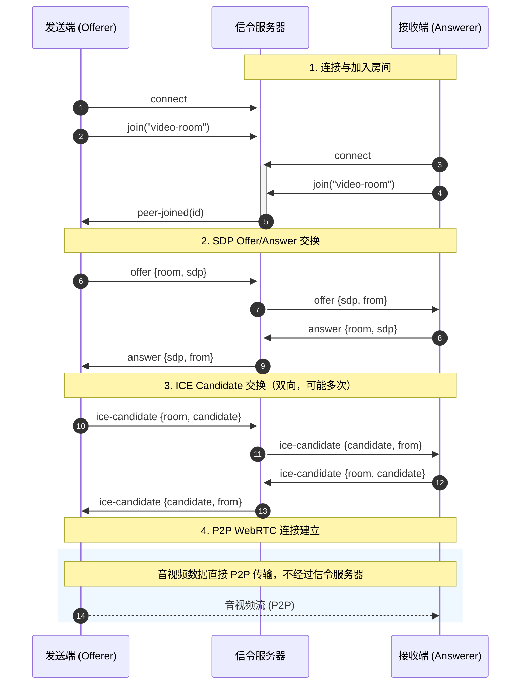

WebRTC 入门连接

客户端如何连接服务端：

Demo 1: Qt 使用 WebEngineView 加载  http://192.168.50.68:3000/receiver.html 到本地

Receiver.html 原理 :


详细解释如下:

根据上图，整体流程是：

1. 用户 A 和用户 B 都需要先连接到信令服务器；
2. 用户 A 和用户 B 都创建一个 PeerConnection（此时 WebRTC 会自动向 STUN/TURN 服务获取 candidate 信息, WebRTC 内置了 ICE）；
3. 用户 A 将本地音视频流添加到 PeerConnection 中（通过 getUserMedia 获取音视频流）；
4. 用户 A 作为发起方创建 offer（offer 中包含了 SDP 信息），并将获取的本地 SDP 信息添加到 PeerConnection 中（setLocalDescription），然后再通过信令服务器转发给用户 B;
5. 用户 B 接收到用户 A 的 offer 后，将其添加到 PeerConnection 中（setRemoteDescription）；
6. 用户 B 将本地音视频流添加到 PeerConnection 中（通过 getUserMedia 获取音视频流）；
7. 用户 B 创建一个 Answer，并添加到 PeerConnection 中（setLocalDescription）;
8. 用户 B 通过信令服务器将 answer 转发给用户 A；
9. 用户 A 接收到 answer 后将其添加到 PeerConnection 中；
10. 用户 A 和 用户 B 都接收到了 candidate 信息后，都通过信令服务器转发给对方并添加到 PeerConnection 中（addIceCandidate）；
11. 媒体信息和网络信息交换完毕后，WebRTC 开始尝试建立 P2P 连接；
12. 建立成功后，双方就可以通过 onTrack 获取数据并渲染到页面上。

**上图是以用户 A 为发起方，用户 B 为接收方。**


本地需求：不需要STUN 和 TURN 服务器


// 如何使用C++ 去连接信令服务器


遇到崩溃问题

``E/rtc     : #`
`E/rtc     : # Fatal error in: ../../media/engine/webrtc_voice_engine.cc, line 806`
`E/rtc     : # last system error: 0`
`E/rtc     : # Check failed: adm_`
`E/rtc     : #` `

已在 `android/AndroidManifest.xml` 中加入 WebRTC 所需的音频权限：

- RECORD_AUDIO：WebRTC 音频设备模块初始化需要
- MODIFY_AUDIO_SETTINGS：音频相关设置需要


1. 确认权限
   在连接前调用 `requestPermissionAndConnect()`，在 logcat 中确认 `VERIFY-1` 中 RECORD_AUDIO 为 0。
   1. 
2. 延迟初始化
   不要在应用启动时立刻调用 `LibWebRTC::Initialize()` / `CreateRTCPeerConnectionFactory()`，等 Activity 完全启动后（例如首次点击「连接接收」）再初始化。
3. 检查初始化时机
   你现在的流程是「收到 Offer 后才 initWebRTC」，理论上不会太早。如果错误仍出现，可尝试：
   - 在 `Component.onCompleted` 或首次显示主界面时延迟 1–2 秒后再允许用户点击连接；
   - 或在应用进入前台后再触发连接逻辑。
4. NDK / API 版本
   查看 libwebrtc 的编译配置与目标 API level，确保与当前设备（以及 Qt/Android 配置）一致，例如在 logcat 中看 `VERIFY-4` 的系统信息。
5. 编译时关闭音频（若仅需视频）
   若只需要视频，可用 `rtc_use_null_audio_device=true` 重新编译 libwebrtc，这样不会再创建真实 ADM，自然也不会触发该错误。
6. 设备/ROM 兼容
   某些定制 ROM 或低端设备对 OpenSL/AAudio 支持不完整，可尝试换一台设备或模拟器验证。


方案二：禁用掉webrtc_voice_engine加载后，动态库无法启动。**No**

方案一：**修改libwebrtc 的配置文件（build.gn） 添加宏    defines += [ "WEBRTC_DUMMY_AUDIO_BUILD" ]**

方案一 已经正常接受流信息，下一部做渲染

修改引入的未知：

​	Dummy Audio APIs 暂时规避策略 无法规避真正问题，需要重新思考解决方案。


测试延时效果一：240~250ms

​	其中终端日志显示：

> D/default : [VideoPerf] frame# 1020 | 线程队列: 28.878 ms | YUV转换: 28.839 ms | 缓冲拷贝: 0.217 ms | 帧间隔: 31.896 ms | 本帧总: 57.934 ms
> D/default : [VideoPerf] paint: 10.274 ms | 全链路(含渲染): 68.208 ms


### **优化方向：YUV 转换加速**

YUV 转换的加速方法主要可以分为**软件层面的优化**和**硬件层面的加速**两大类。选择哪种方法，通常取决于你的应用场景（是 PC 软件、移动端 App 还是嵌入式设备）、性能要求以及成本预算。

下面这个表格汇总了各种加速方法及其核心特点，可以让你先有一个整体的印象。

| 加速方法                 | 核心原理                                                     | 适用平台                        | 性能提升示例                                                 |
| :----------------------- | :----------------------------------------------------------- | :------------------------------ | :----------------------------------------------------------- |
| **🧠 软件优化：指令集**   | 利用CPU的SIMD（单指令多数据流）指令集（如x86的**SSE/AVX**、ARM的**NEON**），并行处理多个像素数据。 | 各种CPU平台                     | 4K图像YUV转RGB，使用SSE2从**2.63秒降至0.60秒**。1080P图像转换缩放，使用NEON从**14ms降至3ms**。 |
| **⚙️ 软件优化：专用库**   | 使用已经高度优化好的专业转换库，如Google的**libyuv**、FFmpeg的**libswscale**、英特尔**IPP**。 | 跨平台                          | 1280x720图像NV12转RGBA，使用libyuv从**90ms降至16ms**。       |
| **🚀 硬件加速：GPU**      | 利用GPU的并行计算能力，通过图形API（如**Vulkan**）或通用计算技术，将转换任务交给GPU处理。 | 配有独立或集成GPU的设备         | 在某些GPU上，性能比CPU库快一个数量级，并能显著减轻CPU负担。  |
| **📦 硬件加速：专用硬件** | 调用芯片上的专用硬件模块（如NVIDIA的**NVENC/NVDEC**、全志平台的**G2D** 2D图形加速器）来完成色彩转换。 | 特定嵌入式平台、NVIDIA Jetson等 | 在资源受限的嵌入式平台上，能显著降低CPU占用率并获得极高效率。 |


​	

Demo 2.0.0 逻辑梳理

> 1. main.cpp
>
>    1. WebRTCVideoRenderer 渲染层
>    2. WebRTCReceiverClient 触发层
>
> 2. webrtc_receiver_client  
>
>    1. webrtc_receiver_client.h 交互层
>    2. webrtc_receiver_client.cpp
>


## 问题点：

### 一：目前编码格式采用的是H264， 是否考虑使用VP8/VP9 的编码格式进行传输

#### 好处：能够使用SVC（scalable video coding） 能够提升视频的质量，弱网情况的流畅性

### 二：解码方式的选择 1、软解 2、硬解（解决CPU资源大量耗费问题）

### 三：转YUV 格式的方式 1、手搓 2、集成libyuv 库 (解决耗时问题)

## 步骤一：连接信令服务器的原理（socket.io）库底层通信

客户端                    服务器 (socket.io 库)
   |                            |
   |--- WebSocket 连接 -------->|  (底层由库自动处理)
   |                            |
   |<-- "0" (Engine.IO open) --|  ← 你看不到，库内部处理
   |                            |
   |--- "40" (connect) ------->|  ← 你看不到，库内部处理  
   |                            |
   |<-- "40" (connected) ------|  ← 你看不到，库内部处理
   |                            |
   |==== 可见的连接Established ====|
   |                            |
   |--- 'connection' 事件 ----->|  ← 你看到的第一个事件


## **步骤二：如何建立信令服务器连接**

> 发送端、接收端通过信令服务器交换 SDP 和 ICE Candidate，建立 P2P 连接后音视频数据直接传输，不经过服务器。

### Mermaid 格式



### 流程说明

| 阶段             | 说明                                                         |
| ---------------- | ------------------------------------------------------------ |
| 1. 连接与加入    | 发送端先连接并加入房间，接收端随后加入；服务器通知发送端有对等端加入 |
| 2. Offer/Answer  | 发送端创建 offer 发往服务器，服务器转发给接收端；接收端创建 answer 发往服务器，服务器转发给发送端 |
| 3. ICE Candidate | 双方收集 ICE 候选，通过服务器转发给对方，用于发现最佳网络路径 |
| 4. P2P 连接      | 信令完成后，音视频数据直接在发送端与接收端之间传输           |


### 详细说明：

#### 连接与加入

> ​	主要作用，发送端和接收端都连接同一个信令服务器，然后当接收端加入房间后，广播通知到发送端有人加入，准备后续的SDP和ICE的信息交换。

#### Offer/Answer

> 主要作用，发送端和接收端交换各自的SDP 信息，用于后续进行流媒体连接提供支持。

Offer : 指的就是信令 主要发送的就是SDP

##### **SDP[][Session Description Protocol (SDP)] 解释如下** : 

> [Session Description Protocol (SDP)](https://en.wikipedia.org/wiki/Session_Description_Protocol) is a standard for describing the multimedia content of the connection such as resolution, formats, codecs, encryption, etc. so that both peers can understand each other once the data is transferring. This is, in essence, the metadata describing the content and not the media content itself.

##### **[Simulcast](https://developer.mozilla.org/en-US/docs/Web/API/WebRTC_API/Protocols#simulcast)**   

> ​	简单来说用于多个网络，提供不同分辨率的码流，SFU 作为决策人，根据网络或者选择提供不同码流给接收端。**P2P不需要**

##### [Scalable video coding](https://developer.mozilla.org/en-US/docs/Web/API/WebRTC_API/Protocols#scalable_video_coding)   

> [Scalable Video Coding (SVC)](https://w3c.github.io/webrtc-svc/) encodes a video source in a single stream, with multiple layers that can be selectively decoded to obtain video with particular resolutions, bitrate, or quality. 
>
> 简单来说：提供更好的分辨率+码率+质量的转换技术，但是需要VP8/VP9 编码格式支持。


##### **SFU and SFM**

> 这两个术语其实指的是**同一个东西**，就像一个人的“身份证名字”和“常用小名”一样 。
>
> - **SFM**：它的全称是 **Selective Forwarding Middlebox**（选择性转发中间盒）。这是互联网工程任务组（IETF）在 **RFC 7667** 规范中定义的官方、标准的学术名称 。
> - **SFU**：它的全称是 **Selective Forwarding Unit**（选择性转发单元）。这是在实际开发和WebRTC社区中最常用、最通俗的叫法 。


##### 软解和硬解

> ### 📌 软解码（Software Decoding）
>
> - **定义**：使用 CPU 运行解码器代码（如 FFmpeg、WebRTC 内置解码器）将压缩视频流解码为原始帧。
> - **优点**：
>   - 兼容性好，支持各种编码格式、Profile 和 Level。
>   - 对动态码率（码流实时变化）**天然完全支持**，解码器能准确解析任何符合标准的码流。
>   - 不受硬件厂商驱动限制，行为稳定可控。
> - **缺点**：
>   - 功耗高，CPU 占用大，高分辨率（如 4K）可能卡顿或发热。
>   - 性能受限于 CPU 频率，可能无法处理超高码率或帧率。
> - **WebRTC 中**：默认集成（如 VP8/VP9/AV1 软件解码器），动态码率场景下工作可靠。
>
> ### 📱 硬解码（Hardware Decoding）
>
> - **定义**：利用 GPU、DSP 等专用硬件单元解码，通过系统 API（Android MediaCodec、iOS VideoToolbox）调用。
> - **优点**：
>   - 性能高、功耗低，能流畅解码 4K/8K 视频。
>   - 释放 CPU 资源，适合移动设备。
> - **缺点**：
>   - 兼容性依赖硬件和驱动，不同设备表现不一。
>   - 对动态码率的支持**通常良好，但存在不确定性**：
>     - 硬件设计时已考虑码流波动，多数情况下能正常解码。
>     - 少数设备可能在码率剧烈突变时出现花屏、丢帧或解码失败（驱动 Bug 或硬件限制）。
>   - 无法随意增加新格式支持，必须硬件本身支持。
> - **WebRTC 中**：优先尝试硬解以节省功耗，但若硬解失败或异常，需自行实现回退软解逻辑。
>
> ### ✅ 一句话总结
>
> - **软解**：一定支持动态码率，兼容性好，但费电。
> - **硬解**：通常支持动态码率，但最终效果取决于具体设备的硬件实现和驱动质量。


##### 编译器打印 Android


##### 几种常见的编码格式

|      维度       |            **H.264**            |             **H.265 (HEVC)**             |      **VP9**       |       **AV1**       |
| :-------------: | :-----------------------------: | :--------------------------------------: | :----------------: | :-----------------: |
|  **推出时间**   |             2003年              |                  2013年                  |       2013年       |       2018年        |
|  **核心关系**   |          **前代标准**           |          **H.264的直接继承者**           | Google的免版税方案 |  下一代免版税方案   |
|  **压缩效率**   |            **基准**             |         **比 H.264 高约 35-50%**         |   与 H.265 相当    | 比 H.265 再高约 30% |
|  **专利费用**   | 有（但 Cisco 提供免费二进制版） |       **复杂且昂贵**（多个专利池）       |      **免费**      |      **免费**       |
| **WebRTC 支持** |          **强制要求**           | **可选，支持有限**。规范制定中，依赖硬件 |    **强制要求**    |   **实验性/可选**   |


#### ICE candidate 候选人	

> 它是 WebRTC 收集到的**可用网络地址列表**（内网 IP、公网 IP、中继地址），用于**P2P 打洞、找到双方能连通的路径**。

##### 当前项目使用场景局域网

> 在**纯局域网、没有公网、不用 STUN/TURN** 的场景下：只需要IP,端口,传输协议

##### **NAT**：内网转公网

> **NAT = 内网 ↔ 公网 的翻译官 + 地址转换器** 这是一堵墙

##### **STUN**：查公网地址

> 告诉你的设备：你在公网的 IP + 端口是多少

##### **TURN**：打不通就中继

> TURN = 实在连不上，走服务器中转。

##### **ICE**：自动打洞连接

> ICE = 自动打洞 + 自动选路的框架。

##### **ICE Candidate**：每一条可用地址

##### 内网穿透技术

> 内网穿透 = 绕过 NAT，让外网直接找到你

##### 总结下网络方面的知识

> 同一网段：直接连，不走路由，不用穿透，裸连。
>
> 不同网段 / 公网：必须走路由，要穿透，要 STUN。


#### P2P 连接

:-1: error: adb.exe: failed to install D:/Mirror/Projects/LibwebRtcDemo/build/Qt_6_8_3_for_Android_arm64_v8a-Debug/android-build-appLibwebRtcDemo//build/outputs/apk/debug/android-build-appLibwebRtcDemo-debug.apk: Failure [INSTALL_FAILED_OLDER_SDK: Failed parse during installPackageLI: /data/app/vmdl1062194407.tmp/base.apk (at Binary XML file line #9): Requires newer sdk version #28 (current version is #25)]


[排查] SDP 协商的 1、服务端抓tcpdum  2、wireshark 解析 [ip.src==192.168.3.20 and !ssh] 

3、

ip.src==192.168.3.20 and !ssh

> 


【优化】视频渲染优化

优化方法：

> ## WebRTC 渲染优化记录
>
> ### 一、改造前
>
> | 项目       | 详情                                             |
> | :--------- | :----------------------------------------------- |
> | 渲染方案   | `QQuickPaintedItem` + `QPainter::drawImage()`    |
> | YUV→RGB    | CPU 软编（libyuv `ConvertToARGB`）               |
> | 数据传递   | `QImage` → `QueuedConnection` → 主线程 `paint()` |
> | 主线程占用 | 约 4~8 ms/帧                                     |
>
> ------
>
> ### 二、改造后
>
> | 项目       | 详情                                                         |
> | :--------- | :----------------------------------------------------------- |
> | 渲染方案   | `QQuickFramebufferObject` + OpenGL Fragment Shader           |
> | YUV→RGB    | GPU Shader 完成（全并行，无 CPU 参与）                       |
> | 数据传递   | `YuvFrameData`（QByteArray Y/U/V） → `synchronize()` → `glTexImage2D` |
> | 主线程占用 | ~0 ms（GL 命令提交在渲染线程）                               |
>
> ------
>
> ### 三、核心改动
>
> 1. 头文件 `webrtc_video_renderer.h`
>
> - 基类从 `QQuickPaintedItem` → `QQuickFramebufferObject`
> - 新增 `YuvFrameData` 结构体（Y/U/V 三通道原始数据）
> - 新增 `takeFrame()`、`timerEvent()`、`createRenderer()`
> - 移除 `QImage`、`paint()` 声明
> - 实现文件 `webrtc_video_renderer.cpp`
>
> - 新增内部类 `WebRTCGLRenderer`（继承 `QQuickFramebufferObject::Renderer`）
> - Fragment Shader 实现 YUV→RGB（BT.601 公式，GPU 并行）
> - `OnFrame()`：只做 YUV plane 拷贝（~1.2ms），不进行 CPU 色彩转换
> - `synchronize()`：调用 `glTexImage2D × 3` 上传纹理（~3ms）
> - `render()`：Shader 绘制 + 统计（~0.3ms）
> - CMakeLists.txt
>
> - `find_package` 加 `OpenGL`
> - `target_link_libraries` 加 `Qt6::OpenGL`
>
> ------
>
> ### 四、统计数据对比
>
> | 指标            | 改造前           | 改造后          |
> | :-------------- | :--------------- | :-------------- |
> | YUV→ARGB（CPU） | 1~3 ms/帧        | 0（消除）       |
> | YUV 拷贝        | —                | ~1.2 ms/帧      |
> | 纹理上传        | —                | ~3 ms/帧        |
> | GPU 渲染        | ~1 ms/帧         | ~0.3 ms/帧      |
> | 主线程占用      | 4~8 ms/帧        | ≈ 0 ms          |
> | 数据上传量      | ARGB: ~3.7 MB/帧 | YUV: ~1.4 MB/帧 |
>
> ------
>
> ### 五、关键注意事项
>
> 1. Qt 6 兼容
>
> `QQuickWindow::resetOpenGLState()` 在 Qt 6 中已移除（Scene Graph 自动管理），所有调用处删除。
>
> 2. stride 处理
>
> `RTCVideoFrame` 的 `StrideY()` 可能不等于 `width()`（行对齐 padding），需逐行拷贝：
>
> if (strideY == w) {
>
> ​    yuvFrame.y = QByteArray(frame->DataY(), w * h);
>
> } else {
>
> ​    yuvFrame.y.resize(w * h);
>
> ​    for (int row = 0; row < h; ++row)
>
> ​        std::memcpy(yuvFrame.y.data() + row * w, frame->DataY() + row * strideY, w);
>
> }
>
> 3. `setMirrorVertically(true)`
>
> `QQuickFramebufferObject` 默认 Y 轴翻转，需加此设置或自行翻转纹理坐标。
>
> 4. `timerEvent` 驱动刷新
>
> `startTimer(1000 / 60)` 替代 `OnFrame → update()` 驱动刷新，避免无帧时不刷新、有帧时频繁刷新的问题。

【优化】硬解码优化

优化方法：

源码开启硬解：

1、linux 如何删除文件夹及文件夹下的所有文件

```
sudo rm -rf 目录名
```

2、linux 如何查看文件
```
cat file
```
3、历史遗留问题
	3-1、打包的include 文件是如何生成的（打包的为wrapper 版的webrtc, 有其他人提供）

4、无法播放的问题

​	4-1、


优化后的结果

| 多功能终端 | 未优化       | 渲染优化后1.0(优化渲染层) | 渲染优化后1.0(优化解码层) |
| ---------- | ------------ | ------------------------- | ------------------------- |
| 抖动缓冲   | 97.8 ms      | ~212.2 ms                 |                           |
| 解码       | 3.65 ms/帧   | ~17.53 ms                 |                           |
| 线程队列   | 13.549 ms/帧 | ~0ms                      |                           |
| YUV转换    | 3.149 ms/帧  | ~1.2 ms（子线程）         |                           |
| 缓冲拷贝   | 0.01 ms/帧   | ~0.3 ms（子线程）         |                           |
| 帧间隔     | 28.153 ms/帧 | ~67.87 ms                 |                           |
| 渲染       | 12.967 ms/帧 | ~3 ms（子线程）           |                           |


