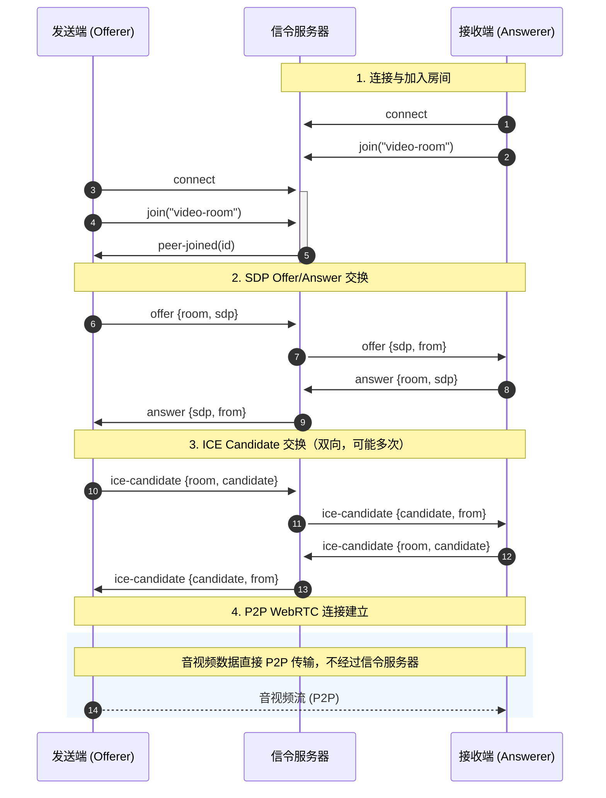

# WebRTC 信令流程时序图

> 发送端、接收端通过信令服务器交换 SDP 和 ICE Candidate，建立 P2P 连接后音视频数据直接传输，不经过服务器。

## Mermaid 格式

## 流程说明

| 阶段 | 说明 |
|------|------|
| 1. 连接与加入 | 接收端先连接并加入房间，发送端随后加入；服务器通知发送端有对等端加入 |
| 2. Offer/Answer | 发送端创建 offer 发往服务器，服务器转发给接收端；接收端创建 answer 发往服务器，服务器转发给发送端 |
| 3. ICE Candidate | 双方收集 ICE 候选，通过服务器转发给对方，用于发现最佳网络路径 |
| 4. P2P 连接 | 信令完成后，音视频数据直接在发送端与接收端之间传输 |

## 预览方式

- **VS Code**：安装 [Mermaid](https://marketplace.visualstudio.com/items?itemName=bierner.markdown-mermaid) 或 [Mermaid Preview](https://marketplace.visualstudio.com/items?itemName=vstirbu.vscode-mermaid-preview) 扩展，在 Markdown 中预览
- **在线**：复制 Mermaid 代码块到 [Mermaid Live Editor](https://mermaid.live/) 查看
- **导出**：在 Mermaid Live Editor 中可导出为 PNG/SVG
